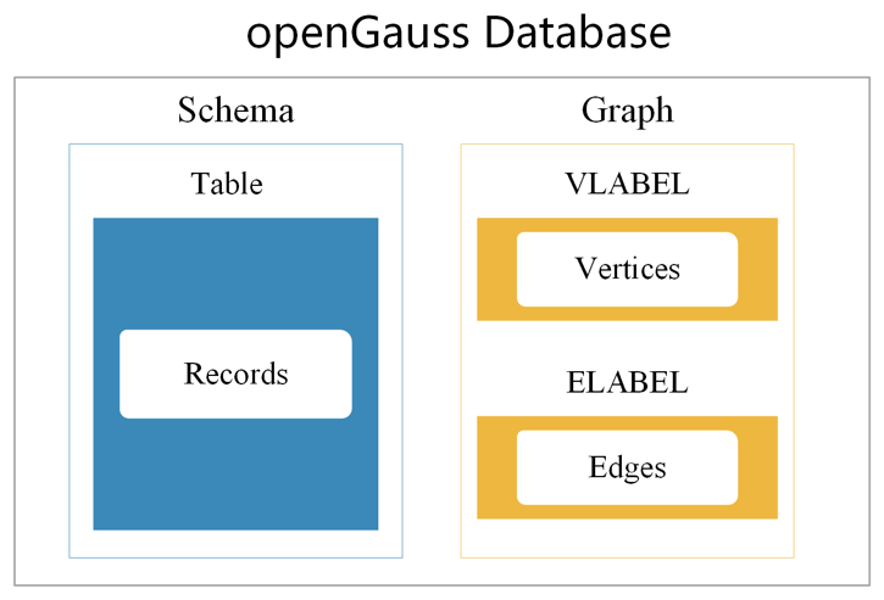

简体中文

- [什么是openGauss-graph](#什么是opengauss-graph)
  - [架构图](#架构图)
  - [特性说明](#特性说明)
  - [什么是openGauss](#什么是opengauss)
- [openGauss-graph编译安装](#opengauss-graph编译安装)
  - [概述](#概述)
  - [操作系统和软件依赖要求](#操作系统和软件依赖要求)
  - [下载openGauss-graph](#下载opengauss-graph)
  - [编译第三方软件](#编译第三方软件)
  - [代码编译](#代码编译)
    - [使用命令编译代码](#使用命令编译代码)
    - [测试安装](#测试安装)
- [快速入门](#快速入门)
- [社区](#社区)
  - [治理](#治理)
  - [交流](#交流)
- [贡献](#贡献)
- [发行说明](#发行说明)
- [许可证](#许可证)

## 什么是openGauss-graph

openGauss-graph是基于[openGauss(3.0.0)](https://gitee.com/opengauss/openGauss-server)关系型存储的图引擎，提供海量图数据的存储和分析能力，支持万亿边PB级数据存储与毫秒级点边查询能力，支持Cypher和SPARQL语言查询，同时处理RDF图和属性图。兼容关系型数据库。携手社区生态伙伴，共建开源开放的图数据库内核和生态。
### 架构图



### 特性说明

1. 设计并定义了知识图谱统一数据模型 
2. 基于openGauss的行存储引擎，设计并实现了兼容RDF图和属性图的知识图谱数据存储管理方案
3. 设计并开发知识图谱数据库查询处理方法，添加SPARQL语法对应功能点，支持基本图模式查询中的路径查询和三元组查询中的链式查询

### 什么是openGauss

openGauss是一款开源的关系型数据库管理系统，它具有多核高性能、全链路安全性、智能运维等企业级特性。
openGauss内核早期源自开源数据库PostgreSQL，融合了华为在数据库领域多年的内核经验，在架构、事务、存储引擎、优化器及ARM架构上进行了适配与优化。作为一个开源数据库，期望与广泛的开发者共同构建一个多元化技术的开源数据库社区。


## openGauss-graph编译安装

### 概述

编译openGauss-graph需要openGauss-graph和binarylibs两个组件。

- openGauss-graph：openGauss-graph的主要代码。可以从开源社区获取。

- binarylibs：openGauss-graph依赖的第三方开源软件，你可以直接编译openGauss-third_party代码获取，也可以从开源社区下载已经编译好的并上传的一个副本。

对于数据库、三方库、GCC的编译以及常见问题，参照博客[openGauss数据库编译指导](https://opengauss.org/zh/blogs/blogs.html?post/xingchen/opengauss_compile/)

在编译openGauss-graph之前，请检查操作系统和软件依赖要求。


### 操作系统和软件依赖要求

openGauss-graph支持以下操作系统：

- CentOS 7.6（x86架构）

- openEuler-20.03-LTS（aarch64架构）

适配其他系统，参照博客[openGauss数据库编译指导](https://opengauss.org/zh/blogs/blogs.html?post/xingchen/opengauss_compile/)

以下表格列举了编译openGauss-graph的软件要求。

建议使用从列出的操作系统安装盘或安装源中获取的以下依赖软件的默认安装包进行安装。如果不存在以下软件，请参考推荐的软件版本。

软件依赖要求如下：

| 软件            | 推荐版本            |
| ------------- | --------------- |
| libaio-devel  | 0.3.109-13      |
| flex          | 2.5.31及以上版本     |
| bison         | 2.7-4           |
| ncurses-devel | 5.9-13.20130511 |
| glibc-devel   | 2.17-111        |
| patch         | 2.7.1-10        |
| readline-devel| 7.0-13          |

可通过下边命令完成安装 
```
sudo yum install flex bison readline-devel ncurses-devel glibc-devel libaio-devel patch -y  
```

### 下载openGauss-graph

可以从gitee仓库下载openGauss-graph ：https://gitee.com/opengauss/openGauss-graph

可以从开源社区下openGauss-third_party，https://opengauss.org/zh/


对于openGauss-third_party，可以通过以下网站获取编译好的binarylibs。下载后请解压缩并重命名为**binarylibs**。

编译好的三方库二进制地址如下：

| 版本和分支            | 下载路径            |
| ------------- | --------------- |
| 3.0.0  |    https://opengauss.obs.cn-south-1.myhuaweicloud.com/3.0.0/openGauss-third_party_binarylibs.tar.gz   |


现在我们已经拥有完整的openGauss-graph代码，把它存储在以下目录中（以sda为例）。

- /sda/openGauss-graph
- /sda/binarylibs

### 编译第三方软件

在编译openGauss-graph之前，需要先编译openGauss-graph依赖的开源及第三方软件。这些开源及第三方软件存储在openGauss-third_party代码仓库中，通常只需要构建一次。如果开源软件有更新，需要重新构建软件。

用户也可以直接从**binarylibs**库中获取开源软件编译和构建的输出文件。

如果你想自己编译第三方软件，请到openGauss-third_party仓库查看详情。 

执行完上述脚本后，最终编译和构建的结果保存在与**openGauss-third_party**同级的**binarylibs**目录下。在编译**openGauss-graph**时会用到这些文件。

### 代码编译

#### 使用命令编译代码

1.获取对应的开源三方库二进制文件：

   可以从对应地址下载 [下载openGauss-graph](#下载opengauss-graph)

2.配置环境变量

```
   export CODE_BASE=/home/omm/openGauss-graph/     # Path of the openGauss-server file
   export BINARYLIBS=/home/omm/binarylibs/    # Path of the binarylibs file
   export GAUSSHOME=$CODE_BASE/dest/     
   export GCC_PATH=$BINARYLIBS/buildtools/openeuler_x86_64[这里替换成操作系统对应的文件夹]/gcc7.3/
   export CC=$GCC_PATH/gcc/bin/gcc
   export CXX=$GCC_PATH/gcc/bin/g++
   export LD_LIBRARY_PATH=$GAUSSHOME/lib:$GCC_PATH/gcc/lib64:$GCC_PATH/isl/lib:$GCC_PATH/mpc/lib/:$GCC_PATH/mpfr/lib/:$GCC_PATH/gmp/lib/:$LD_LIBRARY_PATH
   export PATH=$GAUSSHOME/bin:$GCC_PATH/gcc/bin:$PATH
```

3.选择一个版本进行配置。
 
   与openGauss编译方式不同的是， CFLAGS 编译选项中增加了 -DGS_GRAPH 的配置.

   **debug**版本：

   ```
     ./configure --gcc-version=7.3.0 CC=g++ CFLAGS='-O0 -DGS_GRAPH' --prefix=$GAUSSHOME --3rd=$BINARYLIBS --enable-debug --enable-cassert --enable-thread-safety --with-readline --without-zlib
   ```

   **release**版本：

   ```
     ./configure --gcc-version=7.3.0 CC=g++ CFLAGS="-O2 -g3 -DGS_GRAPH" --prefix=$GAUSSHOME --3rd=$BINARYLIBS --enable-thread-safety --with-readline --without-zlib
   ```

   **memcheck**版本：

   ```
     ./configure --gcc-version=7.3.0 CC=g++ CFLAGS='-O0 -DGS_GRAPH' --prefix=$GAUSSHOME --3rd=$BINARYLIBS --enable-debug --enable-cassert --enable-thread-safety --with-readline --without-zlib --enable-memory-check
   ```

   > **注意** 
   >
   > - *[debug | release | memcheck]*表示有三个目标版本可用。 
   > - 在ARM平台上，需要把**-D__USE_NUMA**添加至**CFLAGS**中。
   > - 在**ARMv8.1**及以上平台（如鲲鹏920），需要把**-D__ARM_LSE**添加至**CFLAGS**中。
   > - 如果**binarylibs**被移至**openGauss-graph**中，或者在**openGauss-graph**中创建了到**binarylibs**的软链接，则不需要指定**--3rd**参数。但请注意，这样做的话，该文件很容易被`git clean`命令删除。

4.执行以下命令编译openGauss-graph：

```
   [user@linux openGauss-graph]$ make -sj
   [user@linux openGauss-graph]$ make install -sj
```

5.显示如下信息，表示编译和安装成功。

```
   openGauss installation complete.
```

- 编译后的软件安装路径为**$GAUSSHOME**。

- 编译后的二进制文件存放路径为：**$GAUSSHOME/bin**。

#### 测试安装
1. 建立数据目录和日志目录：
```
   [omm@linux openGauss-graph]$ mkdir /home/omm/gaussdata
   [omm@linux openGauss-graph]$ mkdir /home/omm/log
```
2. 数据库初始化：
```
   # 使用目录/home/omm/gaussdata作为数据库数据存放位置
   [omm@linux openGauss-graph] gs_initdb -D /home/omm/gaussdata --nodename=db1 
```
3. 启动数据库
```
   [omm@linux openGauss-graph] gs_ctl start /home/omm/gaussdata -Z single_node -l /home/omm/log/opengauss.log
```
4. gsql 连接数据库
```
   [omm@linux openGauss-graph] gsql -d postgres
```


## 快速入门

openGauss-graph图引擎[快速入门](doc/quick_start.md)。

更多关系型数据库的使用教程和API可参考openGauss相关[用户文档](https://gitee.com/opengauss/docs)。

<!-- ## 使用文档 

更多详细资料查看[使用文档 ](doc/graph_detail.md)。 -->

## 社区

### 治理

查看openGauss是如何实现开放[治理](https://gitee.com/opengauss/community/blob/master/governance.md)。

### 交流

- WeLink：开发者的交流平台。
- 邮件列表：graph@opengauss.org
- openGauss-graph sig组仓库主页 https://gitee.com/opengauss/tc/tree/master/sigs/Graph

## 贡献

欢迎大家来参与贡献。详情请参阅openGauss的[社区贡献](https://opengauss.org/zh/contribution.html)。

## 发行说明

请参见[发行说明]

## 许可证

[MulanPSL-2.0](http://license.coscl.org.cn/MulanPSL2/)
